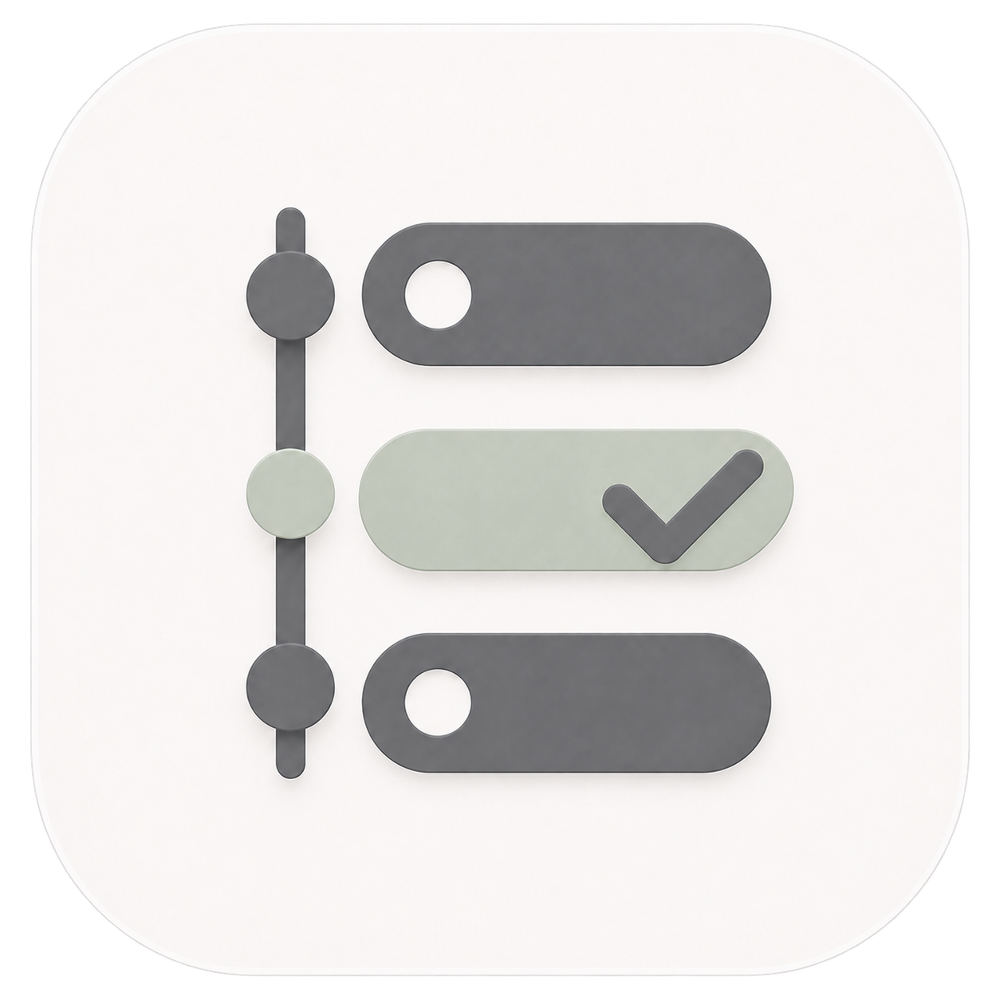

<p align="center">
  
</p>

<h1 align="center">ScheduleBar</h1>

<p align="center">
  A local-first macOS menu bar app for turning explicit work commitments into reviewable tasks.
</p>

ScheduleBar combines a native SwiftUI app, a local SQLite store, and an optional Codex plugin. It keeps upcoming work visible in the menu bar while preserving a clear boundary between ordinary conversation and an intentional task record.

> [!IMPORTANT]
> Ordinary Chat/Work conversation is not captured automatically. Use Quick Add or explicitly say `record as task`, `记录为任务`, or `记为任务`. Local Codex lifecycle hooks are the automatic capture path. Remote or cloud sessions are reconciled only after their session files become available locally; this is not real-time capture.

## Features

- Menu bar views for overdue, today, next-seven-day, waiting, and candidate items.
- Quick Add plus candidate review, edit, confirmation, and rejection.
- Workflow status, priority, owner, tags, reminders, recurrence, dependencies, and acceptance tracking.
- Reviewable plan proposals with task and milestone structure.
- Project association based on working directories.
- Archive, trash, history, JSON backup, retry, and redacted diagnostics.
- Optional Codex lifecycle hooks and MCP tools with explicit success, duplicate, candidate, ignored, and `未记录` receipts.
- Local reconciliation for synced Codex JSON/JSONL session files.

## Requirements

- macOS 14 or later.
- Xcode with a Swift 6.4 toolchain.
- Codex with plugin support, only if the Codex integration is needed.

The Makefile uses the Xcode already installed at `/Applications/Xcode-beta.app/Contents/Developer` by default and does not change the global developer directory.

## Quick start

```sh
git clone https://github.com/LeoAKALiu/schedulebar.git
cd schedulebar
make test
make run
```

`make run` builds, packages, ad-hoc signs, and opens `.build/ScheduleBar.app`. Building and testing do not install anything into the current user's Codex configuration.

For the optional Codex plugin, preview the user-level changes before installing:

```sh
make plugin-preview
make plugin-install
codex plugin list --json
```

Restart Codex after installation. See [Personal installation and rollback](docs/INSTALL.md) for the complete procedure and rollback boundary.

## Recording work

Use **Quick Add** from the menu bar for manual entry.

In Chat/Work, use an explicit request:

```text
record as task File the weekly report by Friday
记录为任务 明天下午 3 点前发送 ScheduleBar 验收周报
```

The equivalent local command is:

```sh
./Plugins/schedulebar/bin/schedulebar-mcp record \
  --text "record as task File the weekly report" \
  --key schedulebar-example-001 \
  --cwd /path/to/project
```

A bare commitment or tentative idea in ordinary Chat/Work is not silently upgraded into an explicit task record.

## Local data and privacy

ScheduleBar stores its primary database at:

```text
~/Library/Application Support/ScheduleBar/schedulebar.sqlite
```

Backups, diagnostics, and locally synced session files live in sibling directories under `Application Support/ScheduleBar/`.

- No clipboard, browser, or Accessibility listener is installed.
- Remote or cloud Codex sessions are not captured in real time.
- Stored excerpts are bounded, and common API-key patterns are redacted before persistence.
- Plugin installation and removal are explicit commands with local backup and rollback records.

## Development

| Command | Purpose |
| --- | --- |
| `make test` | Run the Swift package test suite. |
| `make xcode-test` | Run tests through the `ScheduleBar-Package` Xcode scheme. |
| `make build` | Build release binaries. |
| `make app` | Package `.build/ScheduleBar.app`. |
| `make verify-app` | Package and verify the app signature. |
| `make run` | Package and open the app. |
| `make plugin` | Build and copy `schedulebar-mcp` into the local plugin bundle. |
| `make plugin-preview` | Preview the Codex plugin installation changes. |
| `make plugin-install` | Install the plugin into the current user's Codex registry. |
| `make plugin-uninstall` | Remove only the ScheduleBar plugin registration. |

## Repository layout

| Path | Contents |
| --- | --- |
| `Sources/ScheduleBar/` | Domain model, SQLite persistence, capture policy, queues, and reconciliation. |
| `Sources/ScheduleBarApp/` | Native SwiftUI menu bar and management interface. |
| `Sources/ScheduleBarMCP/` | MCP server, lifecycle-hook entry point, and record command. |
| `Plugins/schedulebar/` | Codex plugin manifest, hooks, MCP configuration, and packaged binary. |
| `Tests/ScheduleBarTests/` | Unit, integration, regression, and acceptance-boundary tests. |
| `docs/` | Installation and repository-agent guidance. |
| `Design/Logo/` | The official ScheduleBar logo asset. |

## Project status

ScheduleBar is a personal, local-first macOS utility under active development. Automated tests, packaging, and signature verification are engineering checks; they do not by themselves constitute installed-app or end-to-end desktop acceptance.
